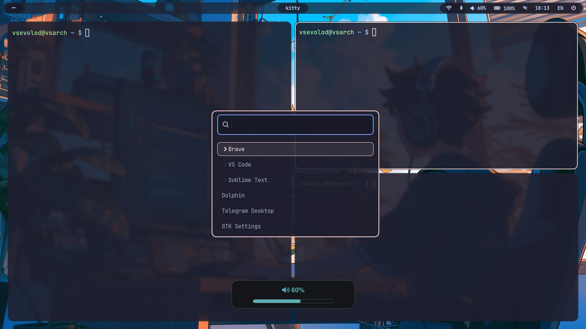

# ArchDots

Arch Linux dotfiles for Hyprland — Catppuccin Mocha theme.




## Stack

| Tool | Role |
|------|------|
| [Hyprland](https://hyprland.org) | Wayland compositor |
| [Waybar](https://github.com/Alexays/Waybar) | Status bar |
| [Wofi](https://hg.sr.ht/~scoopta/wofi) | App launcher |
| [Hyprlock](https://github.com/hyprwm/hyprlock) | Lock screen |
| [Hyprpaper](https://github.com/hyprwm/hyprpaper) | Wallpaper |
| [Dunst](https://dunst-project.org) | Notifications |
| [Kitty](https://sw.kovidgoyal.net/kitty/) | Terminal |
| [wlogout](https://github.com/ArtsyMacaw/wlogout) | Logout menu |

## Structure

```
.config/
├── hypr/
│   ├── hyprland.conf       # Entry point
│   ├── modules/            # Modular config (input, keybindings, appearance…)
│   ├── waybar/             # Bar config, styles, scripts
│   ├── hyprlock.conf
│   └── hyprpaper.conf
├── wofi/
├── dunst/
└── wlogout/
```

See [DOCS.md](DOCS.md) for full keybindings reference.
